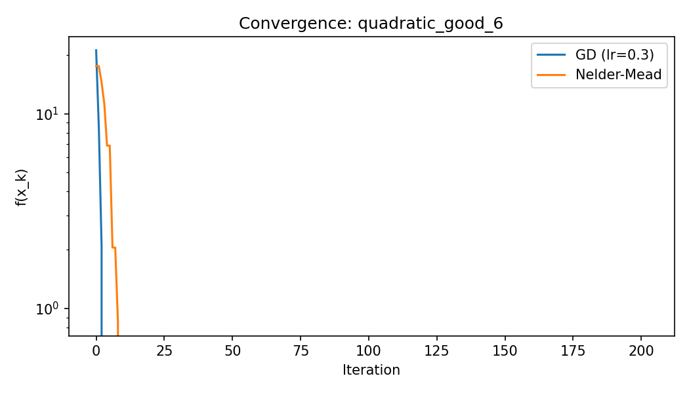
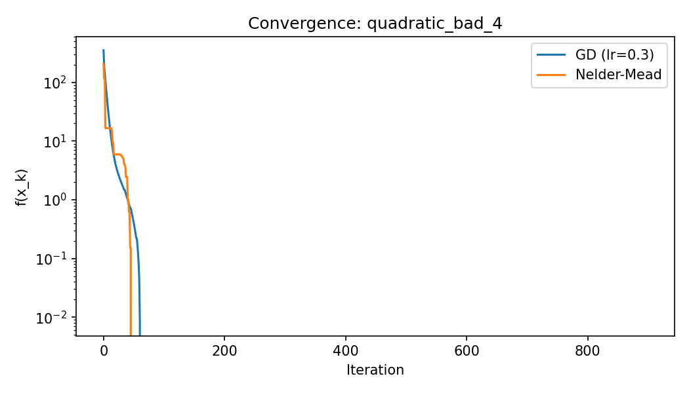
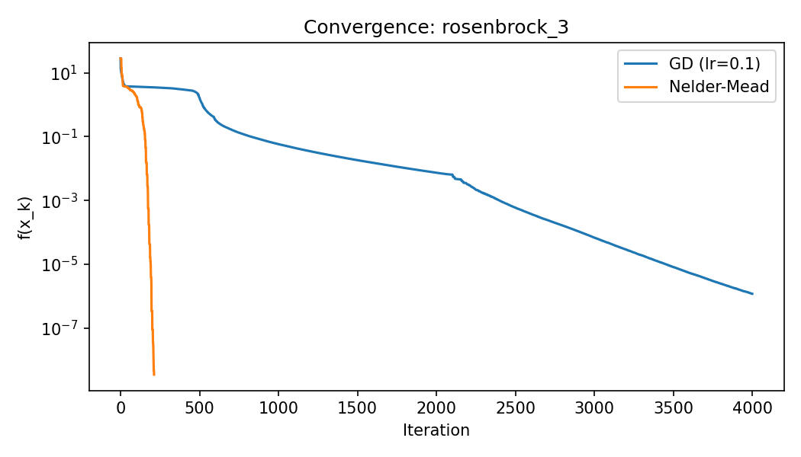
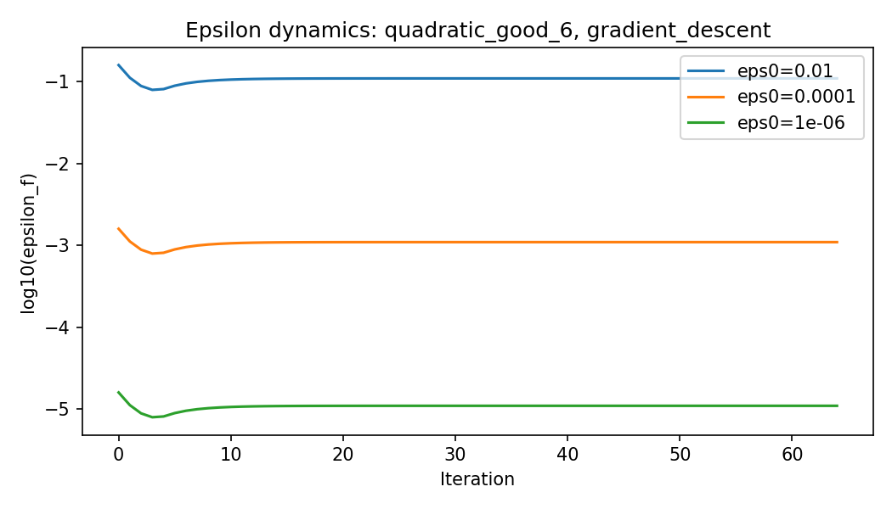
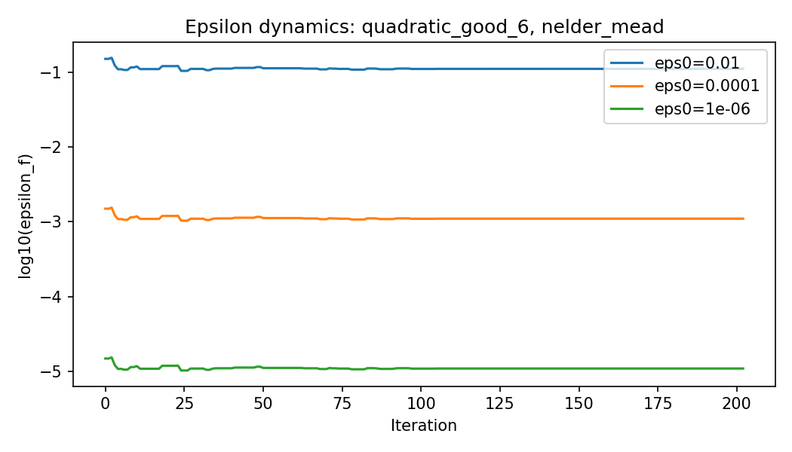
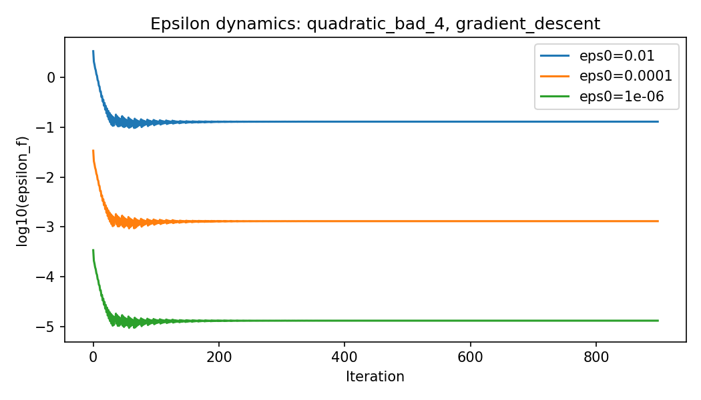
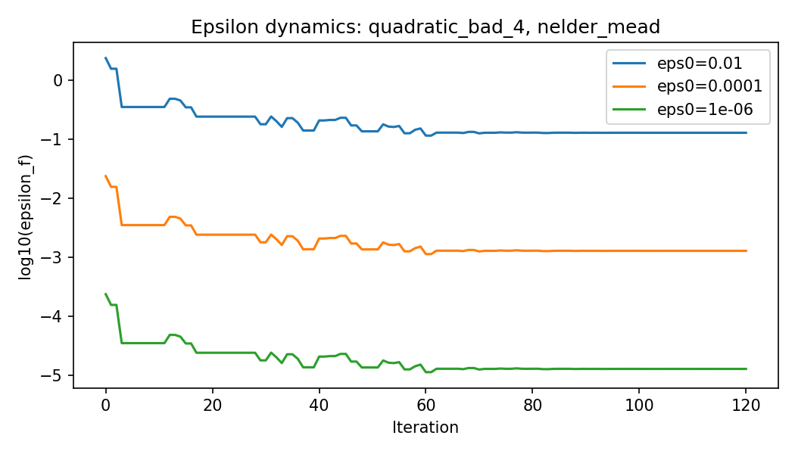
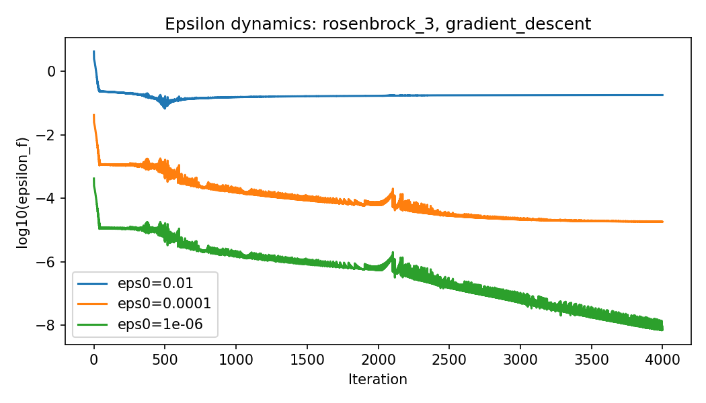
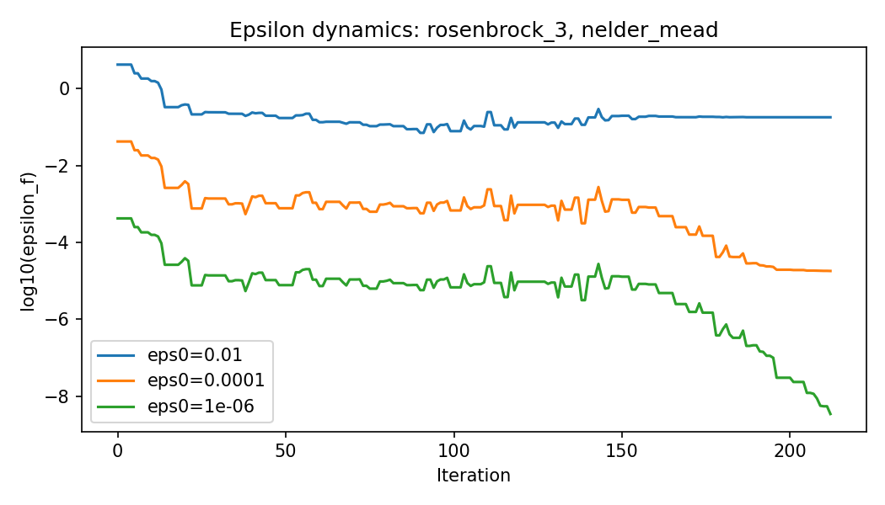

# Лабораторная работа №1

## 1. Цель и постановка

Цель работы: реализовать тип данных **"конструктивное число"**, унифицированные **black-box** функции, методы оптимизации **0-го порядка** (Нелдера-Мида) и **1-го порядка** (градиентный спуск), а затем провести исследование скорости и качества сходимости.

Исследование выполнено в ноутбуке [Research.ipynb](./Research.ipynb).

## 2. Что реализовано

### 2.1. Блок "Конструктивное число"

Реализован класс `ConstructiveNumber` с интервальным представлением числа `[a, b]`, где `a, b ∈ Q`.

Основные возможности:
- создание из границ: `from_bounds(a, b)`
- создание из вещественного значения и погрешности: `from_real(x, epsilon)`
- арифметические операции `+`, `-`, `*`, `/` (включая операции с обычными числами)
- сравнения
- восстановление вещественного значения через параметр `alpha in [0, 1]` (`to_real`)

Код: [scr/ConstructiveNumber.py](./scr/ConstructiveNumber.py)

### 2.2. Блок "Черный ящик"

Реализован единый интерфейс `BlackBox` (`value`, `gradient`, `hessian`) и три тестовые функции
- квадратичная 6-мерная с хорошей обусловленностью
- квадратичная 4-мерная с плохой обусловленностью
- функция Розенброка

Код: [scr/BlackBox.py](./scr/BlackBox.py)

### 2.3. Блок "Методы оптимизации"

Реализованы:
- `gradient_descent` с backtracking
- `nelder_mead`
- общий роутер `optimize`

Код: [scr/Optimization.py](./scr/Optimization.py)

### 2.4. Блок "Исследование"

Подготовлены инструменты экспериментов:
- подсчет вызовов функции/градиента (`CountingBox`)
- подбор `learning rate` для GD
- вычисление эталонного минимума
- построение траекторий и анализ динамики `epsilon`

Код: [scr/ToolsResearch.py](./scr/ToolsResearch.py)

## 3. Методика экспериментов

1. Для каждой функции выполнялся подбор `learning rate` для GD на сетке  
`[1e-4, 3e-4, 1e-3, 3e-3, 1e-2, 3e-2, 1e-1, 3e-1]`.
2. После выбора лучшего шага запускались два метода: `gradient_descent` и `nelder_mead`
3. Сравнение выполнялось по метрикам качества и затрат:
- `converged` - выполнил ли метод критерий остановки
- `iterations` - сколько итераций 
- `time_sec` - время работы в секундах
- `f_calls`, `g_calls` - сколько раз вычислялось значение целевой функции и градиент
- `f_best` - лучшее (минимальное) найденное значение функции за запуск
- `f_gap` - разница между найденным значением и эталонным минимумом `f*`
- `x_err_l2` - расстояние между найденной точкой `x_best` и эталонной `x*`
4. Дополнительно исследована динамика погрешности конструктивного числа по `epsilon_f` для трех уровней начальной погрешности `1e-2, 1e-4, 1e-6`.

## 4. Результаты экспериментов

### 4.1. Подобранные learning rate для GD

| Функция | Лучший learning rate |
|---|---:|
| `quadratic_good_6` | 0.3 |
| `quadratic_bad_4` | 0.3 |
| `rosenbrock_3` | 0.1 |

Таблица в CSV: [report_assets/best_lr.csv](./report_assets/best_lr.csv)

### 4.2. Сравнение методов по метрикам

| Функция | Метод | Converged | Iter | Time, s | f_calls | g_calls | f_gap | x_err_l2 |
|---|---|---|---:|---:|---:|---:|---:|---:|
| `quadratic_good_6` | GD | True | 65 | 0.0008 | 137 | 65 | -4.44e-16 | 8.53e-09 |
| `quadratic_good_6` | Nelder-Mead | True | 203 | 0.0120 | 3159 | 0 | 1.05e-08 | 1.48e-04 |
| `quadratic_bad_4` | GD | True | 899 | 0.0173 | 5389 | 899 | -2.22e-16 | 7.20e-09 |
| `quadratic_bad_4` | Nelder-Mead | True | 121 | 0.0037 | 1421 | 0 | 2.76e-09 | 6.37e-05 |
| `rosenbrock_3` | GD | False | 4000 | 0.0415 | 30023 | 4000 | 1.18e-06 | 2.22e-03 |
| `rosenbrock_3` | Nelder-Mead | True | 213 | 0.0028 | 2068 | 0 | 3.48e-09 | 9.40e-05 |

Полная таблица в CSV: [report_assets/results_metrics.csv](./report_assets/results_metrics.csv)

### 4.3. Графики сходимости

- `quadratic_good_6`: 
- `quadratic_bad_4`: 
- `rosenbrock_3`: 

### 4.4. Динамика epsilon

Ниже показаны графики `log10(epsilon_f)` по итерациям для `epsilon0 = 1e-2, 1e-4, 1e-6`.

- `quadratic_good_6`, GD: 
- `quadratic_good_6`, Нелдер - Мида: 
- `quadratic_bad_4`, GD: 
- `quadratic_bad_4`, Нелдер - Мида: 
- `rosenbrock_3`, GD: 
- `rosenbrock_3`, Нелдер - Мида: 

Таблица с метриками epsilon: [report_assets/epsilon_metrics.csv](./report_assets/epsilon_metrics.csv)

## 5. Интерпретация результатов

1. На хорошо обусловленной квадратичной функции GD значительно быстрее Нелдер - Мида по времени и числу вызовов функции.
2. На плохо обусловленной квадратичной функции Нелдер - Мида заметно выигрывает по числу итераций и времени.
3. На функции Розенброка GD не достиг сходимости за лимит 4000 итераций, в то время как Нелдер - Мида сошелся за 213 итераций и дал существенно меньшие `f_gap` и `x_err_l2`.
4. Динамика `epsilon_f` показывает ожидаемую чувствительность к начальному `epsilon0`: с уменьшением `epsilon0` финальная погрешность по функции уменьшается примерно на соответствующий порядок.
5. Для Розенброка Нелдер - Мида продемонстрировал более устойчивое поведение.

## 6. Общие выводы

- Реализованы: конструктивные числа, black-box функции, методы 0-го и 1-го порядка, экспериментальное сравнение.
- Выбор метода зависит от геометрии функции:
  - для хороших квадратичных задач эффективен GD при корректном подборе шага
  - для более сложных/плохо обусловленных рельефов Нелдер - Мида оказался надежнее.
- Качество оптимизации необходимо оценивать не только по близости к минимуму (`f_gap`, `x_err_l2`), но и по вычислительной цене (`f_calls`, `g_calls`, `time_sec`).

## 7. Ссылки на материалы

- Ноутбук исследования: [Research.ipynb](./Research.ipynb)
- Реализация конструктивного числа: [scr/ConstructiveNumber.py](./scr/ConstructiveNumber.py)
- Реализация black-box функций: [scr/BlackBox.py](./scr/BlackBox.py)
- Реализация методов оптимизации: [scr/Optimization.py](./scr/Optimization.py)
- Инструменты исследования: [scr/ToolsResearch.py](./scr/ToolsResearch.py)
